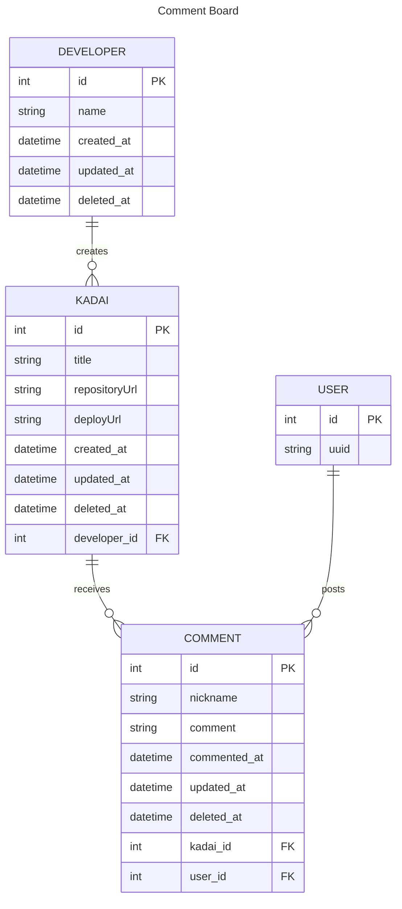

```mermaid

---
title: Comment Board
---
erDiagram
    DEVELOPER ||--o{ KADAI: creates
    KADAI ||--o{ COMMENT : receives
    USER ||--o{ COMMENT : posts
    DEVELOPER{
      int id  PK
      string name
      datetime created_at
      datetime updated_at
      datetime deleted_at
    }

    KADAI {
      int id PK
      string title
      string repositoryUrl
      string deployUrl
      datetime created_at
      datetime updated_at
      datetime deleted_at
      int developer_id FK
    }

    COMMENT {
      int id PK
      string nickname
      string comment
      datetime commented_at
      datetime updated_at
      datetime deleted_at
      int kadai_id FK
      int user_id FK
    }

    USER {
      int id PK
      string uuid
    }

```
